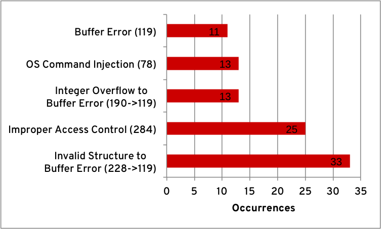
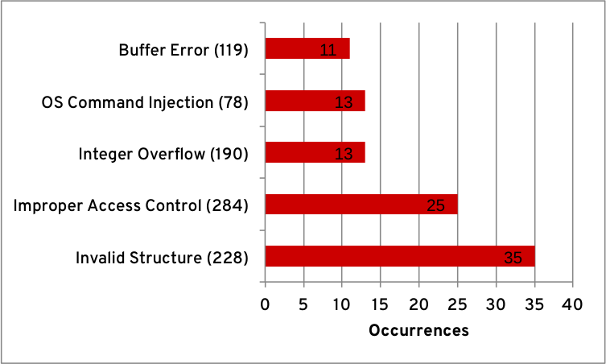
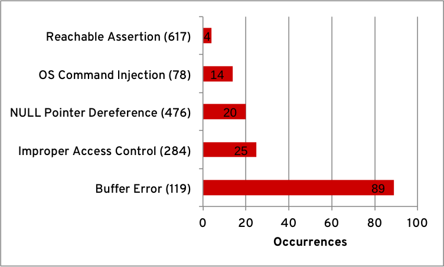

---
authors:
  - rcvalle
date: 2012-09-05
categories:
  - Security
tags:
  - cwe
  - security development lifecycle
  - vulnerability assessment
updated: 2012-09-05
---

# CWE Risk Assessment Report for Red Hat

> [!info]
> This post was also published at
> <https://access.redhat.com/blogs/766093/posts/1975723>.

> [!info]
> This post was also published at
> [https://securityblog.redhat.com/2012/09/05/cwe-vulnerability-assessment-report/](https://web.archive.org/web/20131212135553/https://securityblog.redhat.com/2012/09/05/cwe-vulnerability-assessment-report/).

Common Weakness Enumeration (CWE) is a dictionary or formal list of common software weaknesses. It is a common language or taxonomy for describing vulnerabilities and weaknesses; a standard measurement for software assurance tools and services’ capabilities; and a base for software vulnerability and weakness identification, mitigation, and prevention.

<!-- more -->

Weaknesses IDs are assigned to vulnerabilities in Red Hat products in chains. A chain is a sequence of two or more weaknesses that are closely linked together, where one weakness X, can directly create the conditions necessary to cause another weakness Y, resulting in a vulnerability. In such cases, CWE refers to X as “primary” to Y, and Y as “resultant” from X.

The following graph shows the top 5 overall weaknesses—including chains—and its occurrences during this assessment period from late 2006 to the end of August 2012. This is the initial and, exceptionally, the largest period because it contains the results of our vulnerability—with a CVSS v2 score higher than or equal to 7 over such a long period of time.

## Top overall weaknesses

The occurrences of “Improper Restriction of Operations within the Bounds of a Memory Buffer (CWE-119)”—or just buffer errors—prevails among the most common software weaknesses within our products. This is because buffer errors can occur independently of any primary (or unidentified) weakness.

Next is “Improper Access Control (CWE-284)”, which encompasses many other related weakness classes. (In future assessments, we may break it into another set of weaknesses.) This CWE has many alternate terms and CWE uses this as a general term (i.e., access control) for the various mechanisms that restrict which users can access which resources.

CWE refers to a weakness as “primary” when the weakness can directly create the conditions necessary to cause another weakness. The following graph shows the top 5 occurrences of primary weaknesses.

## Top primary weaknesses

“Improper Handling of Syntactically Invalid Structure (CWE-228)” comes in first place. These assignments mostly refer to the improper handling of invalid network protocol messages or file formats, where many of these would end up being classified as “Improper Handling of Length Parameter Inconsistency (CWE-130)”.

In third place is “Integer Overflow or Wraparound (CWE-190)”. All occurrences of CWE-190 are primary to CWE-119, and is also the second most occurring weakness that is primary to CWE-119. This may indicate a deficiency in some topics of secure coding standards, such as [integers](https://wiki.sei.cmu.edu/confluence/pages/viewpage.action?pageId=270) and [memory management](https://wiki.sei.cmu.edu/confluence/pages/viewpage.action?pageId=437).

The resultant weaknesses require that the conditions necessary for their occurrence have been caused by a primary weakness. The following graph shows the top 5 occurrences of resultant weaknesses:

## Top resultant weaknesses

Apart from the previously noted weaknesses, in the third place is “NULL Pointer Dereference (CWE-476)”, which often occurs in the Linux kernel. These occurrences are sometimes a resultant weakness from “Operation on a Resource after Expiration or Release (CWE-672)”, which in turn are resultant from “Concurrent Execution using Shared Resource with Improper Synchronization ('Race Condition') (CWE-362)”, a noted and commonly recurring pattern.

These assessment results allow us to understand the sensitive areas in our products. CWE is a measurement tool that can help us understand the types of security issues being fixed, so we can better plan how to address those issues going forward.
