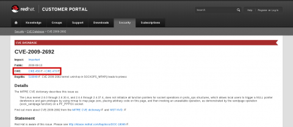
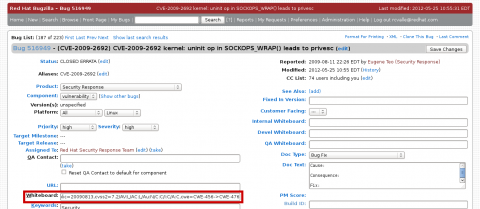

---
authors:
  - rcvalle
date: 2012-11-01
categories:
  - Security
tags:
  - cwe
  - security development lifecycle
  - vulnerability assessment
updated: 2012-11-01
---

# CWE Compatibility for Red Hat

> [!info]
> This post was also published at
> <https://access.redhat.com/blogs/766093/posts/1975773>.

> [!info]
> This post was also published at
> [https://securityblog.redhat.com/2012/11/01/red-hat-is-now-cwe-compatible/](https://web.archive.org/web/20150906094027/https://securityblog.redhat.com/2012/11/01/red-hat-is-now-cwe-compatible/).

Red Hat is pleased to announce it has attained Common Weakness Enumeration (CWE) compatibility.

The CWE Compatibility and Effectiveness Program is a formal review and evaluation process for declaring products and services as “CWE-Compatible” and “CWE-Effective”. For the last few months, Red Hat was engaged in the CWE Compatibility and Effectiveness Program and worked towards fulfilling its requirements. These requirements included providing a common language for discussing, identifying, and dealing with the causes of vulnerabilities in our products.

<!-- more -->

MITRE, in collaboration with government, industry, and academic stakeholders, is improving the measurability of security through registries of baseline security data, providing standardized languages as means for accurately communicating the information, defining proper usage, and helping establish community approaches for standardized processes. CWE, along with Common Vulnerability and Exposures (CVE) and Open Vulnerability and Assessment Language (OVAL), is part of [MITRE's vulnerability management area](https://measurablesecurity.mitre.org/directory/areas/vulnerabilitymanagement.html).

After a long process of properly creating CWE coverage, assigning CWEs to all of the most severe vulnerabilities in Red Hat products, and going through the evaluation process, Red Hat is proud to announce that the Red Hat Customer Portal is now officially [CWE-Compatible](https://cwe.mitre.org/compatible/questionnaires/20.html).

You may use the search functionality at the top of the [Red Hat Customer Portal](https://access.redhat.com/) to find vulnerabilities corresponding to one or more CWE identifiers. On the individual CVE pages, each CWE element listed is linked to the page containing its detailed description on the [MITRE website](https://cwe.mitre.org/).

Alternatively, you may also use the Bugzilla search interface, or directly refer to the “Whiteboard” field of a particular vulnerability, such as [Bug CVE-2009-2692](https://bugzilla.redhat.com/show_bug.cgi?id=CVE-2009-2692). Note that you need to be logged in to Bugzilla to be able to see the full “Whiteboard” field.

The CWE coverage for Red Hat Customer Portal is reviewed and updated twice a year, along with the release of a CWE risk assessment report. CWE identifiers are assigned to Red Hat vulnerabilities using the present CWE coverage at the time of the vulnerability assessment. Thus, references to vulnerabilities are divided into “time slices” based on the date the vulnerability was assessed and the present CWE coverage at that time. For additional information, refer to the [CWE Coverage for Red Hat Customer Portal](docs/blog/posts/2012-07-02-cwe-coverage-for-red-hat-customer-portal.md) and [CWE Compatibility for Red Hat Customer Portal](docs/blog/posts/2012-06-15-cwe-compatibility-for-red-hat-customer-portal.md) posts.
